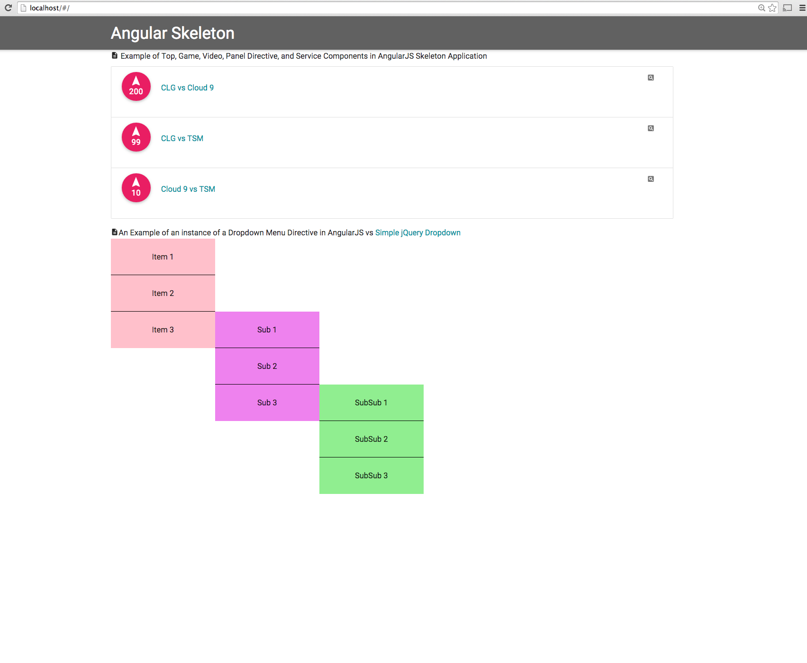

## Maintainable Angular Skeleton and ( AngularJS Dropdown Directive vs jQuery Dropdown )

This project shows the layout and sample files of a maintainable AngularJS application skeleton with angular-route. It uses SASS and Material Design repo Materialize.

One of the directives (angular dropdown) compares the differences between a simple dropdown implemented in jQuery.

Folder structure: the angular application is organized by feature components instead of models-views-controllers for maintainability.


## Usage

The angularJS application can be run from any web host, simply clone the repo and point to your web host:

```bash
git clone https://github.com/iammai/angular-skeleton-app-directive-example.git
```

You'll see the angularJS application and how its components are organized (game, top page, services, directives like panels and dropdowns, etc).

The [angular dropdown directive](https://github.com/iammai/angular-skeleton-app-directive-example/tree/master/app/components/dropdown) is also demonstrated.

The comparison jquery version of the angular-dropdown [vs-simple-down](https://github.com/iammai/angular-skeleton-app-directive-example/tree/master/vs-jquery-dropdown) is a folder that can be run from the web host or directly out of the folder.

PNG of Dropdown Directive in the AngularJS Application:

